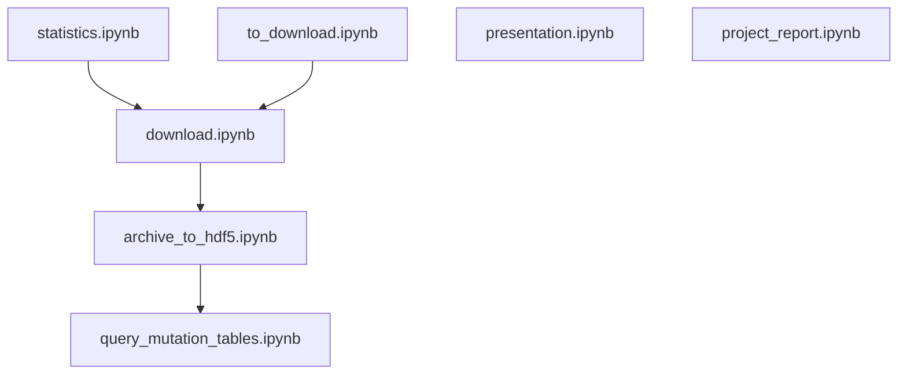

# PMC Tables

Extract relational tables from PubMed Central.

## Features

- Download articles and supplemental material from NCBI PubMed Central and EuroPMC.
- Extract tables from articles and supplemental material and save then in HDF5 files.

## Notebooks

This repository contains the pipeline for extracting and processing tables from [PubMed Central](https://www.ncbi.nlm.nih.gov/pmc) and [Europe PMC](https://europepmc.org/).

## Additional resources

- [Data package](https://gitlab.com/datapkg/pmc-tables-pipeline) - Repository of Jupyter notebooks showing how to run the entire PMC tables pipeline.
- [Project report](https://gitlab.com/strokach/courses/CSC2525/blob/master/project/paper.pdf) - Project report in which I describe PMC tables.
- [Project presentation](https://docs.google.com/presentation/d/1oSOegvLNX5IsO4RpASwptsjSnoC9DsfBDnIT908QOZU/edit?usp=sharing) - Slides for a course presentation in which I describe PMC tables.
